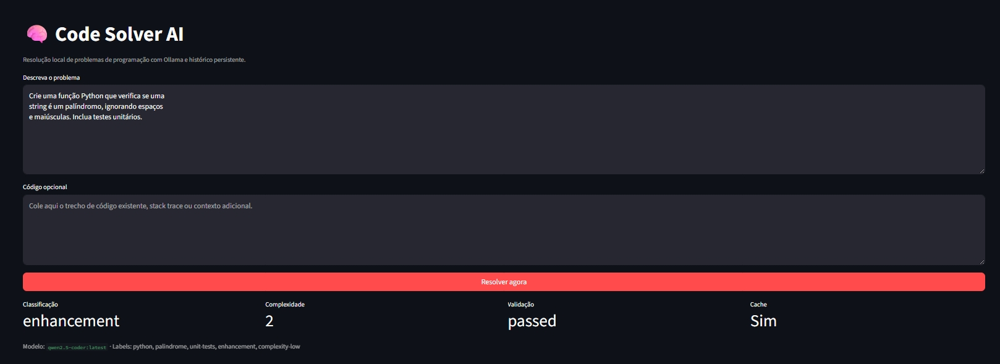

# Code Solver AI


## 🎥 Demo

Pipeline completo funcionando com Ollama local — classificação, geração de código, testes e validação em tempo real.



Uma ferramenta de IA local que analisa problemas de programação e gera soluções completas com:

- ✅ **Classificação automática** do problema (bug, enhancement, feature, etc.)
- ✅ **Análise estruturada** passo a passo com plano de ação
- ✅ **Geração de código** completo e testes automatizados
- ✅ **Validação local segura** em ambiente isolado
- ✅ **Relatório detalhado** em Markdown com explicações
- ✅ **Auto-repair** inteligente quando a validação falha
- ✅ **Cache inteligente** com TTL (24h padrão) para evitar reprocessamento
- ✅ **Suporte multilíngua**: Python, JavaScript, TypeScript, Java, Go, Rust

**100% offline** - roda localmente com modelos Ollama, sem APIs pagas.

## Arquitetura

O sistema implementa um pipeline completo:

```
classify → reason → code → validate → auto-repair → report
```

- **core/solver.py** - Orquestrador principal do pipeline
- **core/classifier.py** - Classifica tipo e complexidade do problema
- **core/reasoner.py** - Gera plano de solução estruturado
- **core/coder.py** - Gera código e testes com retry automático
- **core/validator.py** - Executa validação segura em sandbox
- **core/cache.py** - Cache JSON com TTL + histórico SQLite
- **models/ollama_client.py** - Cliente Ollama com fallback automático

## Requisitos

### Sistema Operacional
- Windows, macOS ou Linux

### Software Necessário
- **Python 3.10+** (testado com 3.10.0)
- **Ollama** - serviço local para modelos de IA
- **Git** (opcional, para clonar o repositório)

### Recursos Recomendados
- **RAM**: 8GB+ (modelos maiores precisam mais)
- **CPU**: 4+ cores (para melhor performance)
- **Disco**: 10GB+ espaço para modelos Ollama

## Stack Tecnológico

- **Python 3.10+** com bibliotecas modernas
- **CLI** com `argparse` + `rich` para interface elegante
- **Web UI** com Streamlit para uso interativo
- **Backend** via Ollama com modelos locais
- **Cache** em JSON com TTL configurável
- **Histórico** persistente em SQLite para contexto

## Estrutura

```text
.
├── main.py
├── app.py
├── core/
├── models/
├── utils/
├── db/
├── tests/
├── examples/
├── config.yaml
├── requirements.txt
└── README.md
```

## Instalação

### 1. Instalar Ollama

**Windows:**
```bash
# Baixe e execute o instalador de https://ollama.ai/download
# Ou via winget
winget install Ollama.Ollama
```

**macOS:**
```bash
brew install ollama
```

**Linux:**
```bash
curl -fsSL https://ollama.ai/install.sh | sh
```

### 2. Iniciar Ollama

```bash
# Inicia o serviço Ollama
ollama serve
```

### 3. Baixar Modelos

```bash
# Modelo principal (recomendado)
ollama pull qwen2.5-coder:latest

# Alternativas
ollama pull codellama:13b
ollama pull deepseek-coder-v2
ollama pull llama3.1:8b
```

### 4. Configurar Projeto

```bash
# Clonar repositório
git clone https://github.com/riichspider/code-solver-ai.git
cd code-solver-ai

# Criar ambiente virtual
python -m venv .venv

# Ativar ambiente
# Windows PowerShell
.venv\Scripts\activate
# Linux/macOS
source .venv/bin/activate

# Instalar dependências
pip install -r requirements.txt

# Instalar como comando global (opcional)
pip install -e .
```

## Configuração

### config.yaml

O arquivo `config.yaml` já vem pré-configurado, mas você pode ajustar:

```yaml
# Modelo principal (será usado se disponível)
default_model: qwen2.5-coder:latest

# Configurações Ollama
ollama:
  base_url: http://localhost:11434/api
  timeout_seconds: 240
  keep_alive: 10m
  options:
    temperature: 0.1
    top_p: 0.9
    num_predict: 2200

# Perfis de execução
profiles:
  fast:
    temperature: 0.05
    num_predict: 1400
    reasoning_style: concise
  deep:
    temperature: 0.15
    num_predict: 3200
    reasoning_style: thorough

# Cache com TTL
cache:
  enabled: true
  directory: db/cache
  ttl_hours: 24  # Cache expira após 24 horas

# Histórico para contexto
history:
  database_path: db/history.db
  similar_results: 3

# Linguagens suportadas
supported_languages:
  - python
  - javascript
  - typescript
  - java
  - go
  - rust
```

### Fallback Automático

Se o `default_model` não estiver instalado, o sistema:
1. Lista modelos disponíveis via Ollama
2. Seleciona automaticamente o primeiro modelo compatível
3. Continua execução normalmente

## Uso via CLI

Resolver um problema direto:

```bash
code-solver "Corrija uma função Python que falha ao remover duplicados preservando a ordem."
```

Sem instalar como pacote:

```bash
python main.py "Implemente busca binária iterativa em Python com testes."
```

### Exemplos de Uso CLI

#### Uso Básico
```bash
# Instalado como pacote
code-solver "Corrija uma função Python que falha ao remover duplicados preservando a ordem."

# Sem instalar como pacote
python main.py "Implemente busca binária iterativa em Python com testes."
```

#### Especificando Linguagem
```bash
# Python
python main.py "Crie uma classe para gerenciar tarefas" --language python

# JavaScript  
python main.py "Implemente função debounce" --language javascript

# TypeScript
python main.py "Crie interface TypeScript com validação" --language typescript

# Java
python main.py "Implemente classe Java para conexões" --language java

# Go
python main.py "Crie servidor HTTP com endpoints REST" --language go

# Rust
python main.py "Implemente estrutura Rust para arquivos" --language rust
```

#### Especificando Modelo
```bash
# Usar modelo específico
python main.py "Otimize este algoritmo" --model qwen2.5-coder:latest

# Comparar modelos
python main.py "Refatore esta função" --compare-models qwen2.5-coder:latest codellama:13b

# Listar modelos disponíveis
python main.py --list-models
```

#### Modos de Execução
```bash
# Modo rápido (padrão)
python main.py "Implemente busca binária" --mode fast

# Modo profundo (mais detalhado)
python main.py "Implemente busca binária" --mode deep

# Com arquivo de contexto
python main.py "Corrija o bug" --context-file examples/context_example.py
```

#### Processamento em Lote
```bash
# Processar múltiplos problemas
python main.py --batch-file examples/problems.md --export-dir exports

# Formato do arquivo batch (problems.md):
# ---
# 1. Implemente busca binária
# ---
# 2. Crie uma classe de pilha
# ---
# 3. Refatore este algoritmo...
```

## Web UI com Streamlit

### Iniciar Interface Web

```bash
streamlit run app.py
```

Acesse `http://localhost:8501` no navegador.

### Funcionalidades da Web UI

- ✅ **Editor de problemas** com syntax highlighting
- ✅ **Upload de arquivos** de contexto
- ✅ **Seleção de linguagem** automática ou manual
- ✅ **Escolha de modelo** com lista dinâmica
- ✅ **Modos fast/deep** com preview das diferenças
- ✅ **Processamento batch** de arquivos `.txt`/`.md`
- ✅ **Download** de código, testes e relatório
- ✅ **Histórico** de soluções anteriores
- ✅ **Visualização** do pipeline em tempo real

### Vantagens da Web UI

- Interface mais amigável que CLI
- Preview do resultado antes de download
- Upload múltiplos arquivos de contexto
- Histórico visual das execuções
- Copiar/colar fácil de problemas complexos

## Pipeline

1. Entendimento do problema
2. Classificação + complexidade
3. Plano de solução
4. Geração de código
5. Validação local segura
6. Formatação do relatório final

Se a validação falhar, o sistema tenta uma rodada de correção automática antes de encerrar.

## Cache e histórico

- Cache: `db/cache/*.json`
- Histórico: `db/history.db` (gerado automaticamente em runtime)

O histórico é usado como memória contextual para reaproveitar soluções similares.

## Exportação

Cada execução pode gerar:

- `solution.md`
- arquivo principal de código
- arquivo de testes
- `metadata.json`

Os arquivos são salvos em `exports/` por padrão.

## Linguagens Suportadas

| Linguagem | Arquivo Código | Arquivo Testes | Framework Testes |
|-----------|----------------|----------------|------------------|
| **Python** | `solution.py` | `test_solution.py` | unittest |
| **JavaScript** | `solution.js` | `test_solution.js` | assert |
| **TypeScript** | `solution.ts` | `test_solution.ts` | console.assert |
| **Java** | `Solution.java` | `SolutionTest.java` | JUnit |
| **Go** | `solution.go` | `solution_test.go` | testing |
| **Rust** | `solution.rs` | `solution_test.rs` | #[test] |

## Modelos Recomendados

### Principais (Recomendados)
- **`qwen2.5-coder:latest`** - Melhor performance geral (~7GB)
- **`codellama:13b`** - Ótimo para problemas complexos (~8GB)
- **`deepseek-coder-v2`** - Alternativa robusta (~7GB)

### Leves (Para recursos limitados)
- **`qwen2.5-coder:1.5b`** - Rápido, menos preciso (~1GB)
- **`llama3.1:8b`** - Bom custo-benefício (~5GB)
- **`qwen2.5-coder-4k:latest`** - Contexto limitado (~3GB)

### Como Escolher

- **Desenvolvimento rápido**: `qwen2.5-coder:1.5b`
- **Problemas simples**: `llama3.1:8b`
- **Uso geral**: `qwen2.5-coder:latest`
- **Problemas complexos**: `codellama:13b`

## Testes

```bash
python -m pytest
```

## Limitações Conhecidas

### Modelos Pequenos (< 4B parâmetros)

⚠️ **Podem apresentar:**
- Código com sintaxe incorreta
- Testes incompletos ou falhando
- Soluções oversimplificadas
- Dificuldade com problemas complexos

**Recomendação:** Use `qwen2.5-coder:latest` ou superior para melhor qualidade.

### Validação Multilíngua

- **Python**: ✅ Validação completa com unittest
- **JavaScript**: ✅ Validação com Node.js (se instalado)
- **TypeScript**: ✅ Validação com ts-node (se instalado)
- **Java**: ⚠️ Requer JDK e compilador
- **Go**: ✅ Validação com go test (se instalado)
- **Rust**: ⚠️ Requer Rust toolchain

### Performance

- **Similaridade**: O(n) acima de 500 entradas no histórico
- **Cache**: TTL de 24h (configurável)
- **Batch**: Processamento sequencial, não paralelo

### Requisitos de Sistema

- **RAM**: Modelos maiores precisam de 8GB+ RAM
- **CPU**: 4+ cores recomendados para performance
- **Disco**: 10GB+ para modelos Ollama

## Roadmap

### ✅ Version 0.1.0 (Current)
- [x] Complete pipeline: classify → reason → code → validate
- [x] Auto-repair functionality with intelligent fallback
- [x] Multi-language support: Python, JavaScript, TypeScript, Java, Go, Rust
- [x] Configurable cache with TTL (24h default)
- [x] CLI and Streamlit web interface
- [x] Health check system with --health-check
- [x] Automatic exports cleanup (max 20 folders)
- [x] Real validation for TypeScript (tsc) and Go (go test)
- [x] CI/CD with GitHub Actions and pytest
- [x] Professional documentation (README, CONTRIBUTING, CHANGELOG, SECURITY)
- [x] Pre-commit hooks with ruff linting and formatting
- [x] Issue and PR templates for community contributions
- [x] MIT license and Dependabot configuration

### 🚀 Planned Features

#### Version 0.2.0
- [ ] **C++ support** - Code generation and validation
- [ ] **Ruby support** - Code generation and validation  
- [ ] **PHP support** - Code generation and validation
- [ ] **LRU eviction** - Smart cache management for large datasets
- [ ] **Benchmarking suite** - Performance testing and comparison
- [ ] **Enhanced web UI** - Improved Streamlit interface with more features
- [ ] **VS Code extension** - Direct integration with code editor

#### Future Versions
- [ ] **Parallel processing** - Batch processing optimization
- [ ] **Plugin system** - Extensible architecture for custom validators
- [ ] **Model fine-tuning** - Custom model training for specific domains
- [ ] **Cloud deployment** - Optional cloud-based processing
- [ ] **Team collaboration** - Shared solutions and team workflows

### 📊 Progress Tracking
- **Current**: 24 tests passing (100% pass rate)
- **Languages**: 6 supported (expanding to 9)
- **CI/CD**: Full automation with GitHub Actions
- **Documentation**: Complete and professional
- **Community**: Ready for contributions

## Observações

- ✅ **100% local** - sem APIs pagas, sem envio de código
- ✅ **Offline completo** - funciona sem internet após setup
- ✅ **Auto-repair** - tenta corrigir falhas automaticamente
- ✅ **Cache inteligente** - evita reprocessamento do mesmo problema
- ✅ **Histórico contextual** - usa soluções anteriores como referência
- ✅ **Sandbox seguro** - execução isolada de código gerado
